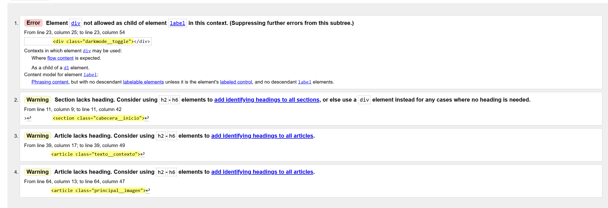
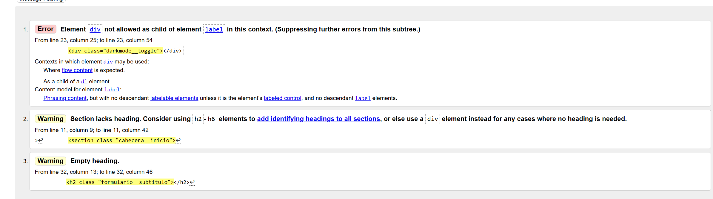
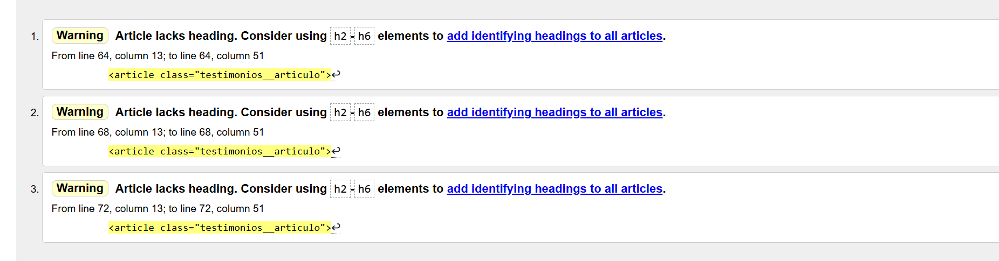

Bienvenido al **Portfolio de Velox**, una empresa innovadora y líder en el sector del automovilismo. A través de este sitio web, podrás explorar nuestros proyectos más destacados, nuestros servicios y ponerte en contacto con nosotros para más información. Este portfolio está diseñado para ofrecerte una visión clara de lo que hacemos y cómo revolucionamos la industria del automovilismo.

## Descripción del Proyecto

Este portfolio digital tiene como objetivo presentar la amplia gama de servicios y proyectos que Velox ha desarrollado en el mundo del automovilismo. A través de un diseño moderno y fácil de navegar, los visitantes pueden descubrir no solo nuestros vehículos de alto rendimiento, sino también los servicios que ofrecemos, nuestra visión empresarial y mucho más.

### Secciones del Portfolio

- **Inicio**: Un resumen visual de lo que Velox representa, incluyendo información destacada sobre la empresa y sus principales logros.
- **Blog**: Publicaciones periódicas sobre innovaciones en automovilismo, noticias de la industria y las últimas actualizaciones de nuestros proyectos y eventos.
- **Servicios**: Un detalle de los servicios que Velox ofrece.
- **Contacto**: Información de contacto para consultas, solicitudes de servicio o colaboraciones con la empresa.

## Instrucciones para Visualizar el Portfolio

1. **Acceso a la Página Web**:  
   Para visualizar el portfolio de Velox, dirígete a:  

2. **Navegación del Sitio**:  
   El sitio web está dividido en las siguientes secciones:  
   - **Inicio**: Sección principal con imágenes destacadas y enlaces a las demás partes del sitio.
   - **Blog**: Accede a las publicaciones más recientes sobre tendencias y noticias del mundo automovilístico.
   - **Servicios**: Infórmate sobre los servicios personalizados que Velox ofrece a sus clientes.
   - **Contacto**: Encuentra todos los detalles para ponerte en contacto con nosotros.

3. **Optimización para Móviles**:  
   El sitio está completamente optimizado para dispositivos móviles y tablets, por lo que puedes disfrutar de una experiencia fluida sin importar el dispositivo que utilices.

4. **Interactividad**:  
   El portfolio incluye elementos interactivos, como imágenes de alta calidad, transiciones y animaciones.

5. **Accesibilidad**:  
   La web está diseñada con la accesibilidad en mente, incluyendo texto alternativo para imágenes, ajustes de contraste y navegación intuitiva.

### Validación de la página web

HTML y CSS validado mediante W3C Validator. Página sin errores.

#### Proceso

- **HTML:**

Documento `index.html`
  
  1-Error: div no permitido dentro de un label en ese contexto (en "botón" para darkmode). Para arreglarlo decidí cambiar       el div por un span.
  
  2-Warning: Elemento h2-h6 faltante en el section del header. Carece de sentido utilizar un section para agrupar todos los elementos ya que de por sí el header ya lo hace. Por lo que decidí eliminar el elemento `section`.
  
  3-Warning: Elemento h2-h6 faltante en el article del contexto. Para arreglar esa parte cambié la estructuración de esa sección (apatado para texto de esa sección). Puse el contenido fuera del article y eliminé el article. El div que agrupa todo el contenido pasó a ser una section con su h3, el contenido anterior y los demás article. Las etiquetas h3 de los demás article pasaron a ser h4. 
  
  4-Warning: Elemento h2-h6 faltante en el article de la imagen. Como no necesitaba un identificador para la imagen, cambie el article por un elemento aside ya que la imagen la utilizo como un recurso complementario de la sección.

Documento `contacto.html`

   
   1-Error: Mismo error que el index ya que pertenece al header (Este error ya arreglado para la validación de los siguienetes documentos).
   
   2-Warning: Mismo warning que el index ya que pertenece al header (Este warning ya arreglado para la validación de los siguienetes documentos).
   
   3-Warning: Elemento h2 vacío. Añadí el contenido del h2.
   

Documento `servicios.html`

   
Los tres warnings coinciden, elemento h2-h6 faltante en los 3 article. Como no necesito un identificador para los testimonios he decidio agruparlos con el elemento ul, y he cambiado los article por los correspondientes elementos li.

El documento blog.html sin errores ni warnings

- **CSS:**

CSS validado sin errrores

